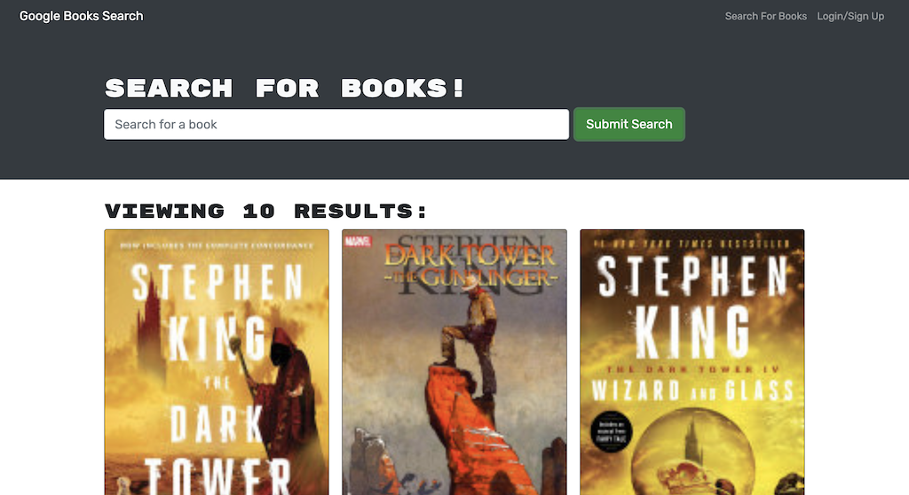

# Book-Search

*A MERN stack application using Google Books API that allows a user to login, search books and save favorites.*

## Table of Contents
- [Description](#description)
- [Installation](#installation)
- [Usage](#usage)
    * [Screenshot](#Screenshot)

## Description

This project is a full stack web application using the MERN Stack to allow users to search books using the Google search API. This application demonstrates skill sets used to refractor an original code using REST APIs into GraphQL with Apollo.

## Installation

To install this application, you will clone the repository from GitHub and `run npm i` or `run npm install` in the root directory. To connect to the server, run `npm run develop`. 

## Usage

This application will allow users to search for books and view 10 results. Users are able to sign up and login in. Logged in users can save a book and view a page of saved books. Users can also remove books from their saved page.
Please view deployed application at [Heroku](https://ah-book-search.herokuapp.com/).

## Screenshot

